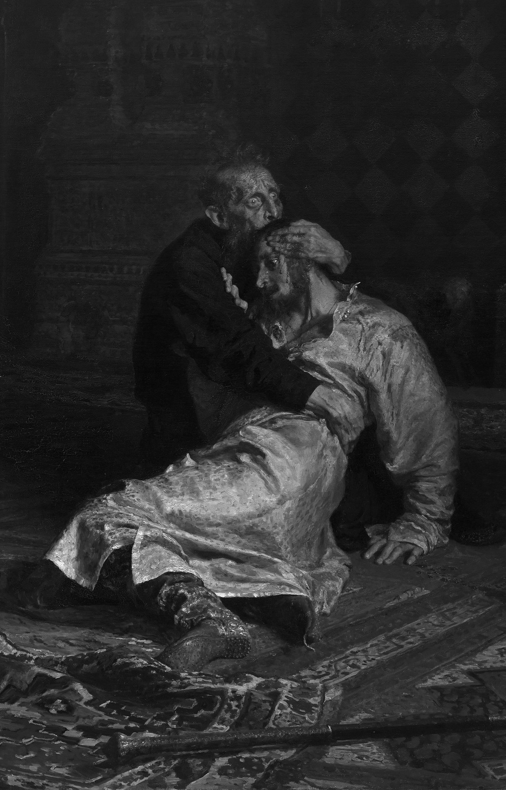

<table>
    <tr>
        <td width="50%" valign="top">
    <h2>Hi, I'm Cristhian</h2>
    

        Fullstack developer with ~2 years of hands-on experience building modern, responsive web applications. I work across the stack — from polished React/Next.js frontends to Node.js/NestJS APIs and serverless solutions.

    

        My stack is mainly focused on Node.js/Typescript, I have experience with React, Next.js, Astro, NestJS, Hono, ORMs like Prisma and DrizzleORM.
    

    

        I'm currently learning more about node.js and typescript applications and architectures. Besides work, I'm also learning bash scripting for recreational programming and searching for Open Source projects to colaborate.
    

    

       Reach me on <a href="https://linkedin.com/in/cristhian-fs" target="_blank">LinkedIn</a>
    

    </td>
        <td width="50%" valign="top">
            
        </td>
    </tr>

</table>
